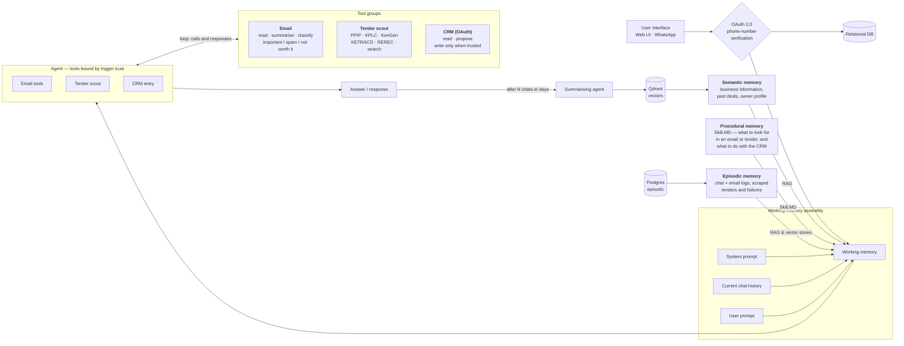

# Batanat Agentic Harness

An agentic operations assistant for a director at a Kenyan energy company. It does three jobs:

1. **Watches Gmail** and alerts him to business opportunities.
2. **Scrapes Kenyan government and parastatal sites** twice daily for energy tenders, and sends a report.
3. **Reads and writes Zoho CRM.**

It is **one agent with three tool groups**, not three agents. Capabilities are bound per trigger —
that is the core security property of the system, and it is enforced by handing the model a
genuinely different tool schema per trigger, not by a prompt instruction or a runtime check.

---

## Architecture

The system as designed on the whiteboard:



> The original hand-drawn diagram belongs at `docs/architecture.png` — drop the export there and it
> can be linked from here alongside the Mermaid version.

### Architecture invariants

Non-negotiable. If a change seems to require breaking one, stop and ask.

1. **A trigger's trust level determines its tool set.** Untrusted triggers (Gmail push, tender cron)
   get read tools and `propose_crm_entry`. Only trusted triggers (web chat, verified WhatsApp) get
   `commit_crm_write`. The tool schema handed to the model genuinely differs.
2. **Untrusted content never enters the system-prompt position.** Email bodies and scraped HTML are
   rendered as clearly delimited quoted data, always.
3. **Every write to Zoho passes through the approval queue**, unless it originates from a trusted
   turn with explicit confirmation.
4. **Every memory row carries a trust tag** — `user_asserted`, `system_derived`,
   `untrusted_external`. Untrusted-derived memory is never injected as instruction.
5. **Everything is idempotent.** Dedupe at the database level with unique constraints.
6. **Every tool call is audit-logged** with inputs, outputs, duration, token cost, and the
   `skill_version_id` that was active.

---

## Stack

| Layer | Choice |
|---|---|
| Frontend | TanStack Start + Router/Query, Bun, TypeScript, Tailwind v4, shadcn/ui, lucide-react |
| Backend | Python 3.12, FastAPI, LangGraph, Pydantic v2, uv |
| Relational | PostgreSQL 16 — users, connections, runs, approvals, tenders, feedback, audit |
| Vectors | Qdrant — semantic memory and document vectors |
| Raw archive | MongoDB — raw email JSON, scraped HTML snapshots, raw tool responses |
| Queue / cache | Redis — scheduler broker, debounce windows, rate limits |

### Where the datastores run

**Postgres, MongoDB and Redis run on the host machine**, as system services, and **Qdrant runs in an
existing container** — this project starts no containers of its own. `docker-compose.yml` is kept as
an alternative for a clean machine; it publishes non-default host ports (55432 / 57017 / 56379) so it
can never collide with the host services. If you use it, switch the URLs in `.env` to the commented
Compose variants.

```bash
make services     # is everything this project needs actually up?
```

---

## Setup

```bash
make setup
```

That installs `uv` into a project-local venv (no system changes), installs Python and Bun
dependencies, and creates `.env` from `.env.example`. Then, in two terminals:

```bash
make api
```

```bash
make web
```

- API — http://localhost:8000 (docs at `/docs` when `APP_ENV=local`)
- Web — http://localhost:3000

The API **creates its Postgres database at startup** if it does not exist, so there is no manual
provisioning step. Tables arrive with Alembic in phase 1.

### Everything CI runs

```bash
make check
```

`cpu-only` → `lint` → `test` → `typecheck`.

---

## Repository layout

```
apps/
  api/                    FastAPI app, agent runtime, tools
    src/batanat_api/
      contracts/          Pydantic models — the source of truth for shared types
      core/               logging, run-id correlation, middleware, db bootstrap
      health/             dependency probes
    scripts/              contract export
    tests/
  web/                    TanStack Start app
    src/routes/           file-based routes
    src/components/ui/    shadcn/ui components
    src/lib/              typed API client, query client
packages/
  schema/                 generated TS types + JSON Schema, consumed by the web app
scripts/
  check-cpu-only.sh       fails the build if a GPU package resolves
  check-services.sh       host datastore reachability
```

### Shared contracts

Pydantic models in `apps/api/src/batanat_api/contracts/` are the single source of truth. They are
exported to `packages/schema/src/generated/` as both JSON Schema and TypeScript:

```bash
make types
```

The generated files **are committed** so a fresh clone typechecks without running Python. CI fails
if they are stale.

---

## CPU-only constraint

This project must never resolve GPU packages. LangGraph is pure Python and harmless — CUDA arrives
transitively via `torch`, pulled in by `sentence-transformers`, `transformers`,
`langchain-huggingface` or `unstructured`. That is ~2.5GB of wheels this project will never execute.

- **Never install** `torch`, `sentence-transformers`, `transformers`, or `unstructured`.
- **Embeddings** come from `qdrant-client[fastembed]` (ONNX, CPU, ~100MB) or an API provider
  (Gemini, Voyage, OpenAI). Never a local torch-backed model.
- If a dependency transitively pulls `nvidia-*`, `triton`, or `cuda*` — **stop and ask.** Do not
  work around it by accepting the install.
- Base images are `python:3.12-slim`. Never a CUDA base image. `CUDA_VISIBLE_DEVICES=""` is set in
  the container as a runtime guard.

```bash
make cpu-only
```

This checks both the installed environment and the declared dependencies, and is wired into CI and
the Docker build so it regresses loudly rather than silently months from now.

---

## Observability

Every unit of work — an HTTP request, a scheduled run, a webhook delivery — carries a `run_id`.
It flows through a contextvar into every log line, is echoed in the `x-run-id` response header, and
is what the Activity screen will key on in phase 7. Logs are one JSON object per line on stdout;
stdlib loggers (uvicorn, asyncpg, httpx) are routed through the same pipeline.

Secrets are redacted in the logging processor, not at the call site — the rule that OAuth tokens are
never logged must not depend on every future author remembering it.

---

## Known constraints

- **Gmail runs in OAuth "Testing" mode.** With a restricted scope and no verification, refresh
  tokens expire after ~7 days. The UI surfaces `access_expires_at` and a prominent "reconnect
  needed" state. The production path is OAuth verification plus a security assessment.
- **Zoho data-centre mismatch is the most common integration failure.** `api_domain` and
  `accounts_url` come back in the token response and are persisted per connection; `zohoapis.com` is
  never hardcoded.
- **WhatsApp utility templates need approval from Meta before launch**, and the number is shared
  across users — senders are mapped to users by a pairing code, not by trusting the phone number.
- **Scrapers are fragile by nature.** Each tender source is behind an interface with a health check;
  a failing source degrades to web search, is marked degraded, and is named in the report rather
  than silently dropped.

---

## Phase status

| Phase | Scope | Status |
|---|---|---|
| 0 | Scaffold, Compose, contracts, CPU-only guard | **done** |
| 1 | Data layer: migrations, token vault | not started |
| 2 | Connections: Gmail, Zoho, WhatsApp pairing | not started |
| 3 | Agent runtime: capability resolver, limits, kill switch | not started |
| 4 | Tools: email, tender sources, CRM | not started |
| 5 | Triggers: Gmail Pub/Sub, tender cron, maintenance | not started |
| 6 | Validation, approvals, notification dispatch | not started |
| 7 | Frontend: six routes, chat, report permalinks | not started |
| 8 | Memory: Qdrant, selective retrieval, summarising agent | not started |
| 9 | Evals, demo mode, docs | not started |
