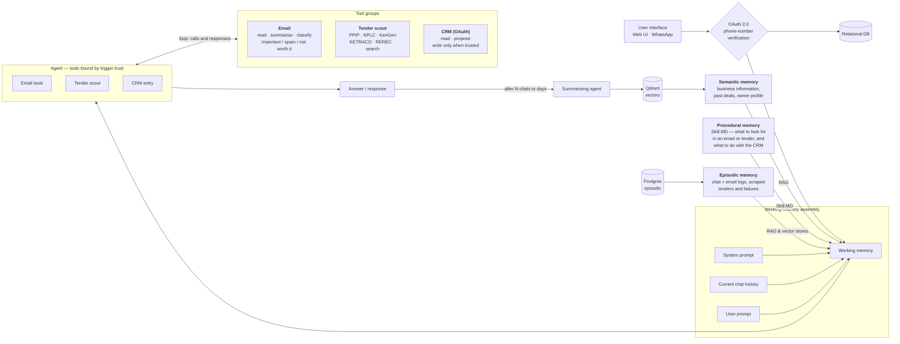

# Batanat Agentic Harness

An agentic operations assistant for a director at a Kenyan energy company. It does three jobs:

1. **Watches Gmail** and alerts him to business opportunities.
2. **Scrapes Kenyan government and parastatal sites** twice daily for energy tenders, and sends a report.
3. **Reads and writes Zoho CRM.**

It is **one agent with three tool groups**, not three agents. Capabilities are bound per trigger —
that is the core security property of the system, and it is enforced by handing the model a
genuinely different tool schema per trigger, not by a prompt instruction or a runtime check.

---

## Architecture

The system as designed on the whiteboard:



> The original hand-drawn diagram belongs at `docs/architecture.png` — drop the export there and it
> can be linked from here alongside the Mermaid version.

### Architecture invariants

Non-negotiable. If a change seems to require breaking one, stop and ask.

1. **A trigger's trust level determines its tool set.** Untrusted triggers (Gmail push, tender cron)
   get read tools and `propose_crm_entry`. Only trusted triggers (web chat, verified WhatsApp) get
   `commit_crm_write`. The tool schema handed to the model genuinely differs.
2. **Untrusted content never enters the system-prompt position.** Email bodies and scraped HTML are
   rendered as clearly delimited quoted data, always.
3. **Every write to Zoho passes through the approval queue**, unless it originates from a trusted
   turn with explicit confirmation.
4. **Every memory row carries a trust tag** — `user_asserted`, `system_derived`,
   `untrusted_external`. Untrusted-derived memory is never injected as instruction.
5. **Everything is idempotent.** Dedupe at the database level with unique constraints.
6. **Every tool call is audit-logged** with inputs, outputs, duration, token cost, and the
   `skill_version_id` that was active.

---

## Stack

| Layer | Choice |
|---|---|
| Frontend | TanStack Start + Router/Query, Bun, TypeScript, Tailwind v4, shadcn/ui, lucide-react |
| Backend | Python 3.12, FastAPI, LangGraph, Pydantic v2, uv |
| Model | Groq or OpenRouter (open weights, default) — Anthropic also supported |
| Relational | PostgreSQL 16 — users, connections, runs, approvals, tenders, feedback, audit |
| Vectors | Qdrant — semantic memory and document vectors |
| Raw archive | MongoDB — raw email JSON, scraped HTML snapshots, raw tool responses |
| Queue / cache | Redis — scheduler broker, debounce windows, rate limits |

### Where the datastores run

**Postgres, MongoDB and Redis run on the host machine**, as system services, and **Qdrant runs in an
existing container** — this project starts no containers of its own. `docker-compose.yml` is kept as
an alternative for a clean machine; it publishes non-default host ports (55432 / 57017 / 56379) so it
can never collide with the host services. If you use it, switch the URLs in `.env` to the commented
Compose variants.

```bash
make services     # is everything this project needs actually up?
```

---

## Setup

```bash
make setup
```

That installs `uv` into a project-local venv (no system changes), installs Python and Bun
dependencies, and creates `.env` from `.env.example`. Then, in two terminals:

```bash
make api
```

```bash
make web
```

- API — http://localhost:8000 (docs at `/docs` when `APP_ENV=local`)
- Web — http://localhost:3000

The API **creates its Postgres database at startup** if it does not exist, so there is no manual
provisioning step. Tables arrive with Alembic in phase 1.

### See it working without any credentials

```bash
make demo
```

Seeds a demo user, four classified emails (including one carrying a prompt
injection, so you can see what the system does with it), four tenders, a run
with a full audit trail, and a pending CRM approval. No external calls.

Other commands worth knowing:

```bash
make sources    # probe every tender source live and print which ones work
make eval       # precision and recall from the 👍/👎 feedback
make reset-db   # drop, re-migrate, re-seed
```

### Everything CI runs

```bash
make check
```

`cpu-only` → `lint` → `test` → `typecheck`.

---

## Repository layout

```
apps/
  api/                    FastAPI app, agent runtime, tools
    src/batanat_api/
      contracts/          Pydantic models — the source of truth for shared types
      core/               logging, run-id correlation, middleware, db bootstrap
      health/             dependency probes
    scripts/              contract export
    tests/
  web/                    TanStack Start app
    src/routes/           file-based routes
    src/components/ui/    shadcn/ui components
    src/lib/              typed API client, query client
packages/
  schema/                 generated TS types + JSON Schema, consumed by the web app
scripts/
  check-cpu-only.sh       fails the build if a GPU package resolves
  check-services.sh       host datastore reachability
```

### Shared contracts

Pydantic models in `apps/api/src/batanat_api/contracts/` are the single source of truth. They are
exported to `packages/schema/src/generated/` as both JSON Schema and TypeScript:

```bash
make types
```

The generated files **are committed** so a fresh clone typechecks without running Python. CI fails
if they are stale.

---

## CPU-only constraint

This project must never resolve GPU packages. LangGraph is pure Python and harmless — CUDA arrives
transitively via `torch`, pulled in by `sentence-transformers`, `transformers`,
`langchain-huggingface` or `unstructured`. That is ~2.5GB of wheels this project will never execute.

- **Never install** `torch`, `sentence-transformers`, `transformers`, or `unstructured`.
- **Embeddings** come from `qdrant-client[fastembed]` (ONNX, CPU, ~100MB) or an API provider
  (Gemini, Voyage, OpenAI). Never a local torch-backed model.
- If a dependency transitively pulls `nvidia-*`, `triton`, or `cuda*` — **stop and ask.** Do not
  work around it by accepting the install.
- Base images are `python:3.12-slim`. Never a CUDA base image. `CUDA_VISIBLE_DEVICES=""` is set in
  the container as a runtime guard.

```bash
make cpu-only
```

This checks both the installed environment and the declared dependencies, and is wired into CI and
the Docker build so it regresses loudly rather than silently months from now.

---

## Screens

| Route | What it is for |
|---|---|
| `/onboarding` | Five-step checklist, derived from what is actually configured, the tour, and load/clear for sample data |
| `/settings/rules-assistant` | Talk through your criteria; it drafts the document, you publish it. Also available as a drawer on `/rules`, where the draft lands in the editor you are already using |
| `/login` | Sign in. Seeded credentials are shown on the page in development only |
| `/` | **Chat** — the front door. Opens with a summary of what is waiting, which retracts once you start typing. Each card links to where that thing lives |
| `/approvals` | The queue. Field-level diff, approve / reject / edit-then-approve |
| `/opportunities` | Opportunities from email and from tender sites, with 👍/👎 that feed `make eval` |
| `/audit` | Audit logs. Every run, expandable to each tool call, its cost and the Skill.MD version |
| `/rules` | Skill.MD editor with live validation, version history and rollback |
| `/settings/knowledge` | Knowledge base — upload PDFs and text into semantic memory |
| `/memory` | View, search and delete memories; trust tag shown on every row |
| `/settings/sources` | Source health, the schedule, and adding your own sites to the sweep |
| `/settings/connections` | Gmail, Zoho, WhatsApp pairing, and a "send test" button per channel |
| `/settings/reports` | Report recipients as a table — one row per address, To or Cc, with a test send |
| `/reports/tenders/:label` | The permalink every report email and alert links to |

Recent chat threads sit in the sidebar under Work, collapsible and persisted. The thread lives
in `?c=<id>`, so switching conversations is navigation: Back works and a thread can be pasted
to someone.

## Conversations

Chat is threaded and persisted, in `conversations` + `chat_messages`. A reload resumes where
you were; the sidebar lists recent threads.

Prior turns are replayed to the model, bounded by **token estimate rather than turn count** —
ten one-line turns and two pasted documents are not the same amount of history. The cap is
25% of `AGENT_TOKEN_BUDGET`, because the runner re-sends the whole message list on every
iteration of the agent loop and each one is charged again. An unbounded transcript does not
cost a little more; it multiplies, and strands the run with "token budget exceeded" that reads
as the agent misbehaving.

**Age does not confer trust.** A reply that quoted a scraped page is stored
`untrusted_external` and is replayed still quoted. Without that a thread becomes a laundering
route: inject once, and every later turn treats it as the assistant's own words.

History is only replayed for triggers in `CONVERSATIONAL_TRIGGERS` — web chat and WhatsApp.
The runner drops it for anything else rather than trusting each call site, so a pushed email
can never be handed what a trusted turn said.

WhatsApp and the web app share threads within 12 hours, so a question asked at a desk can be
followed up from a phone.

## WhatsApp

A chat interface, not only an alert channel. A paired handset can ask anything the web app can,
and replies are split into short messages rather than one wall of text.

Two things it deliberately cannot do:

- **Commit a CRM write by talking.** `approve_pending` and `commit_crm_write` are both absent
  from its tool schema. Approving still works — `APPROVE 2` is parsed by
  `approvals.parse_decision_reply` *before* the model runs. The difference is between "the
  handset can answer a question we asked" and "anything that can reach the model can talk it
  into a CRM write", and only the first is a gate.
- **Act unattributed.** An unpaired number gets a generic reply and nothing else.

The number in an approval alert and the index `APPROVE n` resolves against both come from
`list_pending`, ordered oldest-first. If they diverged, replying would approve a different
record than the one you were shown.

**The 24-hour window is the operational catch.** Free-form messages only leave the building
within 24 hours of the user's last inbound message. Outside it Meta rejects the send, so a
report or alert silently does not arrive even though everything is configured correctly. The
UI says so on the WhatsApp tab. Approved templates are exempt and are the real fix.

## Tender relevance

The national portal publishes every procuring entity in Kenya, so roughly two thirds of what
we ingest is classrooms, police posts and fencing. Two layers, cheap first:

1. **Keyword triage** at ingest — energy vocabulary and procuring entity, scored into
   `relevance_score`. Positive signals are tested *before* exclusions, so "solar water pumping
   at a classroom block" stays a solar tender.
2. **The model**, for the ambiguous band only, batched 40 titles per call. Your Skill.MD goes
   with the question, so editing the Rules page changes what comes back. A confident keyword
   verdict is never overturned — the cheap layer is also the predictable one.

**The store keeps everything; the report filters.** A scoring rule that wrongly drops a real
lead is invisible if the row was never saved, so everything is ingested and scored and the
filtering happens at display. Off-sector tenders are one toggle away on `/opportunities`, and
the report email says how many were withheld.

Email relevance works differently on purpose: it is entirely Skill.MD's call. `classify_email`
only validates the verdict against the enum and stores it — the scoring is the model's, against
your criteria. Write "brand deals are opportunities" and that is what gets marked, with no code
change. Tender relevance is the rigid one; email relevance is meant to move.

## Authentication

Session-based: an opaque token in Redis, referenced by an HttpOnly cookie. Not a JWT —
a JWT cannot be revoked without server state anyway, and once you are keeping server state
the token may as well carry nothing worth forging. Signing out actually ends the session.

Passwords are hashed with `hashlib.scrypt` from the standard library (n=2^15, r=8, p=1,
~0.6s per hash on this hardware). No bcrypt or argon2 dependency, and the stored form carries its own
parameters so the cost can be raised later without invalidating existing hashes.

```
email     martin@batanat.co.ke
password  batanat-dev
```

Seeded by `make seed`, and shown on the login page in development. **The API refuses to
start when `APP_ENV` is anything other than `local` and the password is still this** — a
default password that ships is not a default, it is a backdoor.

Every API endpoint requires the session; the client-side route guard is only there to save
the user from a screen of failed requests.

**Deployment constraint.** `SESSION_COOKIE_SAMESITE` defaults to `lax`, which requires the
API and the web app to share a registrable domain — `api.example.com` and `app.example.com`
are fine, two different domains are not. Split them and the browser silently stops sending
the cookie: every request arrives unauthenticated with nothing in the logs to say why.

Set it to `none` when they genuinely cannot share a site. Two ngrok tunnels are the common
case, because `ngrok-free.app` is on the Public Suffix List and two subdomains under it are
different *sites*. `none` requires `Secure`, which `cookie_kwargs` forces on rather than
trusting whoever edits `.env` — a cookie without it is silently discarded by every browser,
which looks exactly like a working API and a broken login.

Prefer sharing a domain in production. `none` re-opens CSRF, and the mutating endpoints have
no token protection.

**`/api/auth/me` does no hashing.** It is called on every page load, and working out
whether an account still has the seeded password by hashing that password against the
stored hash put 0.6s and 32MB on the hottest endpoint in the app — a handful of browser
tabs regaining focus together was enough to stall the API. It is a stored column now
(`users.must_change_password`), set at seed time and cleared when a real password is set.
The general rule: a KDF verifies a secret someone submitted, it never derives a fact.

## Model providers

The agent is not tied to a vendor. `LLM_PROVIDER` selects one:

| Value | Endpoint | Default model | Key |
|---|---|---|---|
| `groq` *(default)* | api.groq.com | `llama-3.3-70b-versatile` | `GROQ_API_KEY` |
| `openrouter` | openrouter.ai | `meta-llama/llama-3.3-70b-instruct` | `OPENROUTER_API_KEY` |
| `anthropic` | api.anthropic.com | `claude-opus-5` | `ANTHROPIC_API_KEY` |

Groq and OpenRouter both speak the OpenAI chat-completions API, so one client
covers both. Set `AGENT_MODEL` to override the default; leave it blank to take
the provider's.

Switching provider is an env change — nothing downstream knows which one is in
use, because the runner depends on a `ModelClient` protocol rather than a
vendor. The one security-relevant detail is that tool schemas differ between
Anthropic and OpenAI formats, so `agent/providers.py` translates them, and there
are tests asserting the translation is exactly one-to-one. A tool that appeared
or changed shape in translation would change what a run can do.

**A caveat worth knowing:** smaller open models are less reliable at emitting
well-formed tool-call JSON. When that happens the runner records a validation
error and the model retries — the intended path, not a crash — but expect more
iterations per run than with a frontier model. Worth watching the token cost on
the Activity screen after switching.

## Scheduling

`ENABLE_SCHEDULER=true` registers three APScheduler jobs, all in `SCHEDULER_TIMEZONE`:

| Job | When | What |
|---|---|---|
| `tender_daily` | 11:00 and 17:00 | Scrape → filter → report → notify |
| `tender_weekly` | 08:00 Monday | Same, 72-hour lookback |
| `maintenance` | 02:00 | Token refresh, Gmail watch renewal, expiring stale approvals |

Off by default so a one-off script or a test run never starts cron jobs. Settings → Sources &
schedule shows the next fire time for each once it is on.

**Use weekday names, not numbers.** APScheduler counts day-of-week from Monday=0 while crontab
counts from Sunday=0, and `CronTrigger.from_crontab` does not remap — so `0 8 * * 1` fires on
**Tuesday**. Nothing catches that at runtime: the job still runs, just on the wrong day. A test
asserts the actual fire times and rejects any numeric weekday in the configured expressions.

The 02:00 job matters more than it sounds: it renews the Gmail watch, which Google expires
every 7 days. Without the scheduler running, Gmail push stops after a week and the only symptom
is that email quietly stops arriving.

## Deployment

`.github/workflows/deploy.yml` builds both images in a matrix and pushes them to Docker Hub. It
depends on `ci.yml`, so nothing publishes from a commit that did not pass.

Every image gets an immutable `:api-<sha>` tag alongside the moving `:api`. A pipeline that only
pushes the moving tag has nothing to roll back *to* — the tag that was good ten minutes ago now
points at the build that broke.

The login screen shows the build it is serving:

```
web 1a2b3c4 · built 2026-08-24T17:05Z
api 0.1.0
```

Two lines on purpose. The web half is baked in by Vite at build time; the API half is fetched.
A mismatch means one of them did not roll, which is otherwise a deploy failure you only find
by behaviour.

Needs `DOCKER_HUB_TOKEN` in repo secrets. `VITE_API_URL` is compiled into the browser bundle
rather than read at runtime, so **one image is tied to one API origin** — a staging image cannot
be promoted to production unless both point at the same API.

`docker-compose.yml` runs `web`, `api`, `scheduler` and `qdrant` as containers; Postgres, Mongo,
Redis and nginx belong on the host. The scheduler is a **separate service with
`ENABLE_SCHEDULER=true` while the API has it false** — the cron jobs are not distributed-safe,
and two schedulers means two tender sweeps and two sets of model calls.

Full VM walkthrough — host packages, datastore binding, nginx, certbot, seeding, rollback:

## Observability

Every unit of work — an HTTP request, a scheduled run, a webhook delivery — carries a `run_id`.
It flows through a contextvar into every log line, is echoed in the `x-run-id` response header, and
is what the Activity screen will key on in phase 7. Logs are one JSON object per line on stdout;
stdlib loggers (uvicorn, asyncpg, httpx) are routed through the same pipeline.

Secrets are redacted in the logging processor, not at the call site — the rule that OAuth tokens are
never logged must not depend on every future author remembering it.

---

## Known constraints

- **Gmail runs in OAuth "Testing" mode.** With a restricted scope and no verification, refresh
  tokens expire after ~7 days. The UI surfaces `access_expires_at` and a prominent "reconnect
  needed" state. The production path is OAuth verification plus a security assessment.
- **Zoho data-centre mismatch is the most common integration failure.** `api_domain` and
  `accounts_url` come back in the token response and are persisted per connection; `zohoapis.com` is
  never hardcoded.
- **Reports are sent via SendGrid, not Gmail.** The Gmail connection is `gmail.readonly`
  by design — the agent reads the inbox and can never send from it. Report delivery rides a
  separate credential (`SENDGRID_API_KEY`) with a separate blast radius. Recipients are set
  per user under Settings → Report recipients, with no environment fallback — two places to
  look is one too many when the question is "where did this report go". Only the *sender* is
  configuration. Nothing a run reads or produces can change where a report lands: the endpoint
  that writes recipients is session-authed and sits outside the capability table.
- **WhatsApp utility templates need approval from Meta before launch**, and the number is shared
  across users — senders are mapped to users by a pairing code, not by trusting the phone number.
- **Scrapers are fragile by nature, and two of five are down.** Verified live on 2026-08-24:
  **PPIP** yields ~310 tenders through its public JSON API rather than its Vue front end —
  as the national portal it covers every procuring entity, which makes the other four largely
  redundant. **REREC** serves a server-rendered table, ~157 tenders. **KETRACO** works via a
  fallback URL: its open-tenders page answers 200 with no table on it, and the source only
  recovered once candidate URLs were required to *parse* rather than merely load. **KPLC and
  KenGen** render client-side and yield nothing; they are marked degraded and covered by PPIP
  and the Tavily search fallback (`TAVILY_API_KEY`). Run `make sources` for today's truth
  rather than trusting this paragraph.
- **KPLC's robots.txt disallows named AI crawlers** (ClaudeBot, GPTBot and others) while allowing
  `User-agent: *` with `Content-Signal: use=reference`. Our scraper declares its own identity, is
  not one of the named crawlers, does not train on the content, and fetches public procurement
  notices for reference. If you would rather not fetch KPLC at all, disable that source row.

---

## What I would change with a budget

Honest list, in the order I would spend on it.

**The two remaining scrapers.** KPLC and KenGen render client-side, so the HTML
we fetch contains no tenders. A headless browser fixes it and costs ~400MB, a
slower cron and a new class of flakiness. PPIP turned out to have a public JSON
API, which is how that one was solved — the same is probably true here, and is
cheaper than a browser. Endpoints first, browser as the fallback.

**Multi-user.** Every table is keyed by `user_id` and every call site takes one,
but the seeder creates a single account and there is no invite flow. The shape
is right; the surface is missing.

**A real queue.** Runs happen inline in the request or the cron tick. That is
fine at this volume and wrong at ten times it — a slow scrape holds a worker,
and a crash mid-run loses the tail. Celery or arq with the existing Redis.

**Classification cost.** Every new email currently goes to the model. A cheap
first pass — sender allowlist, keyword prefilter, thread deduplication — would
cut that substantially before anything expensive runs.

**The Skill.MD validator.** It is regex heuristics guarding something that does
not actually need guarding, since no security decision reads that document. I
would either make it a warning rather than a rejection, or replace it with a
structured editor where the dangerous shapes are simply not expressible.

**Observability beyond logs.** Every run has an id, a cost and a duration in
Postgres, which is most of the way to useful. What is missing is a place to see
cost-per-run trending up, or a source that has quietly been degraded for a week.

**Test isolation for the network.** The tender tests exercise parsing against
fixtures, but `make sources` hits live sites. A recorded-cassette layer would
make source regressions catchable in CI rather than on a Tuesday morning.

## Phase status

| Phase | Scope | Status |
|---|---|---|
| 0 | Scaffold, Compose, contracts, CPU-only guard | **done** |
| 1 | Data layer: migrations, token vault | **done** |
| 2 | Connections: Gmail, Zoho, WhatsApp pairing | **done** (needs client credentials to verify live) |
| 3 | Agent runtime: capability resolver, limits, kill switch | **done** |
| 4 | Tools: email, tender sources, CRM | **done** (Gmail/Zoho need credentials to run live) |
| 5 | Triggers: Gmail Pub/Sub, tender cron, maintenance | **done** |
| 6 | Validation, approvals, notification dispatch | **done** |
| 7 | Frontend: eight routes, chat, report permalinks | **done** |
| 8 | Memory: Qdrant, selective retrieval, summarising agent | **done** |
| 9 | Evals, demo mode, docs | **done** |

Built after the phase plan, in response to QA:

| Area | What |
|---|---|
| Conversations | Threaded chat, persisted and replayed, browsable in the sidebar |
| WhatsApp | Chat interface with chunked replies; approve-by-reply loop end to end |
| Tender relevance | Keyword + model filtering, so the report is energy rather than everything |
| PPIP | Rewritten onto its JSON API — the one source that covers every procuring entity |
| Report recipients | Per user, set in the UI, no environment fallback |
| Test sends | A button per channel, because SendGrid and Meta only fail at send time |
| Deployment | Docker Hub matrix build, immutable tags, build stamp on the login screen |
