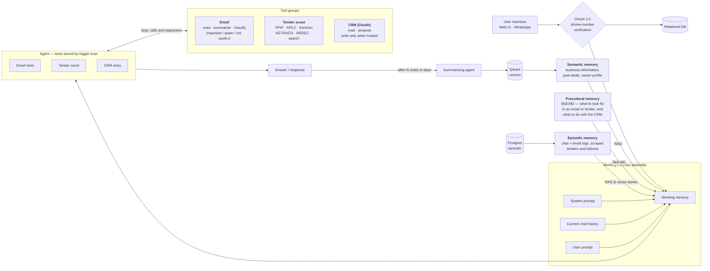

# Batanat Agentic Harness

An agentic operations assistant for a director at a Kenyan energy company. It does three jobs:

1. **Watches Gmail** and alerts him to business opportunities.
2. **Scrapes Kenyan government and parastatal sites** twice daily for energy tenders, and sends a report.
3. **Reads and writes Zoho CRM.**

It is **one agent with three tool groups**, not three agents. Capabilities are bound per trigger —
that is the core security property of the system, and it is enforced by handing the model a
genuinely different tool schema per trigger, not by a prompt instruction or a runtime check.

---

## Architecture

The system as designed on the whiteboard:



> The original hand-drawn diagram belongs at `docs/architecture.png` — drop the export there and it
> can be linked from here alongside the Mermaid version.

### Architecture invariants

Non-negotiable. If a change seems to require breaking one, stop and ask.

1. **A trigger's trust level determines its tool set.** Untrusted triggers (Gmail push, tender cron)
   get read tools and `propose_crm_entry`. Only trusted triggers (web chat, verified WhatsApp) get
   `commit_crm_write`. The tool schema handed to the model genuinely differs.
2. **Untrusted content never enters the system-prompt position.** Email bodies and scraped HTML are
   rendered as clearly delimited quoted data, always.
3. **Every write to Zoho passes through the approval queue**, unless it originates from a trusted
   turn with explicit confirmation.
4. **Every memory row carries a trust tag** — `user_asserted`, `system_derived`,
   `untrusted_external`. Untrusted-derived memory is never injected as instruction.
5. **Everything is idempotent.** Dedupe at the database level with unique constraints.
6. **Every tool call is audit-logged** with inputs, outputs, duration, token cost, and the
   `skill_version_id` that was active.

---

## Stack

| Layer | Choice |
|---|---|
| Frontend | TanStack Start + Router/Query, Bun, TypeScript, Tailwind v4, shadcn/ui, lucide-react |
| Backend | Python 3.12, FastAPI, LangGraph, Pydantic v2, uv |
| Model | Groq or OpenRouter (open weights, default) — Anthropic also supported |
| Relational | PostgreSQL 16 — users, connections, runs, approvals, tenders, feedback, audit |
| Vectors | Qdrant — semantic memory and document vectors |
| Raw archive | MongoDB — raw email JSON, scraped HTML snapshots, raw tool responses |
| Queue / cache | Redis — scheduler broker, debounce windows, rate limits |

### Where the datastores run

**Postgres, MongoDB and Redis run on the host machine**, as system services, and **Qdrant runs in an
existing container** — this project starts no containers of its own. `docker-compose.yml` is kept as
an alternative for a clean machine; it publishes non-default host ports (55432 / 57017 / 56379) so it
can never collide with the host services. If you use it, switch the URLs in `.env` to the commented
Compose variants.

```bash
make services     # is everything this project needs actually up?
```

---

## Setup

```bash
make setup
```

That installs `uv` into a project-local venv (no system changes), installs Python and Bun
dependencies, and creates `.env` from `.env.example`. Then, in two terminals:

```bash
make api
```

```bash
make web
```

- API — http://localhost:8000 (docs at `/docs` when `APP_ENV=local`)
- Web — http://localhost:3000

The API **creates its Postgres database at startup** if it does not exist, so there is no manual
provisioning step. Tables arrive with Alembic in phase 1.

### See it working without any credentials

```bash
make demo
```

Seeds a demo user, four classified emails (including one carrying a prompt
injection, so you can see what the system does with it), four tenders, a run
with a full audit trail, and a pending CRM approval. No external calls.

Other commands worth knowing:

```bash
make sources    # probe every tender source live and print which ones work
make eval       # precision and recall from the 👍/👎 feedback
make reset-db   # drop, re-migrate, re-seed
```

### Everything CI runs

```bash
make check
```

`cpu-only` → `lint` → `test` → `typecheck`.

---

## Repository layout

```
apps/
  api/                    FastAPI app, agent runtime, tools
    src/batanat_api/
      contracts/          Pydantic models — the source of truth for shared types
      core/               logging, run-id correlation, middleware, db bootstrap
      health/             dependency probes
    scripts/              contract export
    tests/
  web/                    TanStack Start app
    src/routes/           file-based routes
    src/components/ui/    shadcn/ui components
    src/lib/              typed API client, query client
packages/
  schema/                 generated TS types + JSON Schema, consumed by the web app
scripts/
  check-cpu-only.sh       fails the build if a GPU package resolves
  check-services.sh       host datastore reachability
```

### Shared contracts

Pydantic models in `apps/api/src/batanat_api/contracts/` are the single source of truth. They are
exported to `packages/schema/src/generated/` as both JSON Schema and TypeScript:

```bash
make types
```

The generated files **are committed** so a fresh clone typechecks without running Python. CI fails
if they are stale.

---

## CPU-only constraint

This project must never resolve GPU packages. LangGraph is pure Python and harmless — CUDA arrives
transitively via `torch`, pulled in by `sentence-transformers`, `transformers`,
`langchain-huggingface` or `unstructured`. That is ~2.5GB of wheels this project will never execute.

- **Never install** `torch`, `sentence-transformers`, `transformers`, or `unstructured`.
- **Embeddings** come from `qdrant-client[fastembed]` (ONNX, CPU, ~100MB) or an API provider
  (Gemini, Voyage, OpenAI). Never a local torch-backed model.
- If a dependency transitively pulls `nvidia-*`, `triton`, or `cuda*` — **stop and ask.** Do not
  work around it by accepting the install.
- Base images are `python:3.12-slim`. Never a CUDA base image. `CUDA_VISIBLE_DEVICES=""` is set in
  the container as a runtime guard.

```bash
make cpu-only
```

This checks both the installed environment and the declared dependencies, and is wired into CI and
the Docker build so it regresses loudly rather than silently months from now.

---

## Screens

| Route | What it is for |
|---|---|
| `/onboarding` | Five-step checklist, derived from what is actually configured, plus the tour |
| `/settings/rules-assistant` | Talk through your criteria; it drafts the document, you publish it. Also available as a drawer on `/rules`, where the draft lands in the editor you are already using |
| `/login` | Sign in. Seeded credentials are shown on the page in development only |
| `/` | **Chat** — the front door. Opens with a summary of what is waiting, which retracts once you start typing. Each card links to where that thing lives |
| `/approvals` | The queue. Field-level diff, approve / reject / edit-then-approve |
| `/opportunities` | Opportunities from email and from tender sites, with 👍/👎 that feed `make eval` |
| `/audit` | Audit logs. Every run, expandable to each tool call, its cost and the Skill.MD version |
| `/rules` | Skill.MD editor with live validation, version history and rollback |
| `/settings/knowledge` | Knowledge base — upload PDFs and text into semantic memory |
| `/memory` | View, search and delete memories; trust tag shown on every row |
| `/settings/sources` | Source health, the schedule, and adding your own sites to the sweep |
| `/settings/connections` | Gmail, Zoho, WhatsApp pairing, token expiry warnings |
| `/reports/tenders/:label` | The permalink every report email and alert links to |

## Authentication

Session-based: an opaque token in Redis, referenced by an HttpOnly cookie. Not a JWT —
a JWT cannot be revoked without server state anyway, and once you are keeping server state
the token may as well carry nothing worth forging. Signing out actually ends the session.

Passwords are hashed with `hashlib.scrypt` from the standard library (n=2^15, r=8, p=1,
~450ms per hash). No bcrypt or argon2 dependency, and the stored form carries its own
parameters so the cost can be raised later without invalidating existing hashes.

```
email     martin@batanat.co.ke
password  batanat-dev
```

Seeded by `make seed`, and shown on the login page in development. **The API refuses to
start when `APP_ENV` is anything other than `local` and the password is still this** — a
default password that ships is not a default, it is a backdoor.

Every API endpoint requires the session; the client-side route guard is only there to save
the user from a screen of failed requests.

## Model providers

The agent is not tied to a vendor. `LLM_PROVIDER` selects one:

| Value | Endpoint | Default model | Key |
|---|---|---|---|
| `groq` *(default)* | api.groq.com | `llama-3.3-70b-versatile` | `GROQ_API_KEY` |
| `openrouter` | openrouter.ai | `meta-llama/llama-3.3-70b-instruct` | `OPENROUTER_API_KEY` |
| `anthropic` | api.anthropic.com | `claude-opus-5` | `ANTHROPIC_API_KEY` |

Groq and OpenRouter both speak the OpenAI chat-completions API, so one client
covers both. Set `AGENT_MODEL` to override the default; leave it blank to take
the provider's.

Switching provider is an env change — nothing downstream knows which one is in
use, because the runner depends on a `ModelClient` protocol rather than a
vendor. The one security-relevant detail is that tool schemas differ between
Anthropic and OpenAI formats, so `agent/providers.py` translates them, and there
are tests asserting the translation is exactly one-to-one. A tool that appeared
or changed shape in translation would change what a run can do.

**A caveat worth knowing:** smaller open models are less reliable at emitting
well-formed tool-call JSON. When that happens the runner records a validation
error and the model retries — the intended path, not a crash — but expect more
iterations per run than with a frontier model. Worth watching the token cost on
the Activity screen after switching.

## Observability

Every unit of work — an HTTP request, a scheduled run, a webhook delivery — carries a `run_id`.
It flows through a contextvar into every log line, is echoed in the `x-run-id` response header, and
is what the Activity screen will key on in phase 7. Logs are one JSON object per line on stdout;
stdlib loggers (uvicorn, asyncpg, httpx) are routed through the same pipeline.

Secrets are redacted in the logging processor, not at the call site — the rule that OAuth tokens are
never logged must not depend on every future author remembering it.

---

## Known constraints

- **Gmail runs in OAuth "Testing" mode.** With a restricted scope and no verification, refresh
  tokens expire after ~7 days. The UI surfaces `access_expires_at` and a prominent "reconnect
  needed" state. The production path is OAuth verification plus a security assessment.
- **Zoho data-centre mismatch is the most common integration failure.** `api_domain` and
  `accounts_url` come back in the token response and are persisted per connection; `zohoapis.com` is
  never hardcoded.
- **Reports are sent via SendGrid, not Gmail.** The Gmail connection is `gmail.readonly`
  by design — the agent reads the inbox and can never send from it. Report delivery rides a
  separate credential (`SENDGRID_API_KEY`) with a separate blast radius, and recipients come
  from `REPORT_TO` / `REPORT_CC` in the environment. Nothing a run reads or produces can
  change where a report lands.
- **WhatsApp utility templates need approval from Meta before launch**, and the number is shared
  across users — senders are mapped to users by a pairing code, not by trusting the phone number.
- **Scrapers are fragile by nature, and four of five are currently degraded.** Verified live on
  2026-08-23: **REREC** serves a server-rendered table and yields ~157 tenders. **KPLC, KenGen,
  KETRACO and PPIP** render their listings client-side, so the HTML we receive contains no tenders
  at all. They are marked degraded and covered by the Tavily search fallback, which needs
  `TAVILY_API_KEY`. Getting them properly would mean a headless browser or each site's private JSON
  endpoint. Run `make sources` for today's truth rather than trusting this paragraph.
- **KPLC's robots.txt disallows named AI crawlers** (ClaudeBot, GPTBot and others) while allowing
  `User-agent: *` with `Content-Signal: use=reference`. Our scraper declares its own identity, is
  not one of the named crawlers, does not train on the content, and fetches public procurement
  notices for reference. If you would rather not fetch KPLC at all, disable that source row.

---

## What I would change with a budget

Honest list, in the order I would spend on it.

**Authentication.** There is none. The PRD has no auth phase and the app assumes
a single seeded user; `get_current_user` is one function, and every call site
already takes a `user_id`, so this is contained — but it is contained *pending*,
not done. First thing I would build before anyone else touches this.

**The four scrapers.** KPLC, KenGen, KETRACO and PPIP render client-side. A
headless browser fixes it and costs ~400MB, a slower cron, and a new class of
flakiness. Their private JSON endpoints are cheaper and break without notice. I
would probably do both: endpoints first, browser as the fallback, search as the
fallback's fallback.

**A real queue.** Runs happen inline in the request or the cron tick. That is
fine at this volume and wrong at ten times it — a slow scrape holds a worker,
and a crash mid-run loses the tail. Celery or arq with the existing Redis.

**Classification cost.** Every new email currently goes to the model. A cheap
first pass — sender allowlist, keyword prefilter, thread deduplication — would
cut that substantially before anything expensive runs.

**The Skill.MD validator.** It is regex heuristics guarding something that does
not actually need guarding, since no security decision reads that document. I
would either make it a warning rather than a rejection, or replace it with a
structured editor where the dangerous shapes are simply not expressible.

**Observability beyond logs.** Every run has an id, a cost and a duration in
Postgres, which is most of the way to useful. What is missing is a place to see
cost-per-run trending up, or a source that has quietly been degraded for a week.

**Test isolation for the network.** The tender tests exercise parsing against
fixtures, but `make sources` hits live sites. A recorded-cassette layer would
make source regressions catchable in CI rather than on a Tuesday morning.

## Phase status

| Phase | Scope | Status |
|---|---|---|
| 0 | Scaffold, Compose, contracts, CPU-only guard | **done** |
| 1 | Data layer: migrations, token vault | **done** |
| 2 | Connections: Gmail, Zoho, WhatsApp pairing | **done** (needs client credentials to verify live) |
| 3 | Agent runtime: capability resolver, limits, kill switch | **done** |
| 4 | Tools: email, tender sources, CRM | **done** (Gmail/Zoho need credentials to run live) |
| 5 | Triggers: Gmail Pub/Sub, tender cron, maintenance | **done** |
| 6 | Validation, approvals, notification dispatch | **done** |
| 7 | Frontend: eight routes, chat, report permalinks | **done** |
| 8 | Memory: Qdrant, selective retrieval, summarising agent | **done** |
| 9 | Evals, demo mode, docs | **done** |
